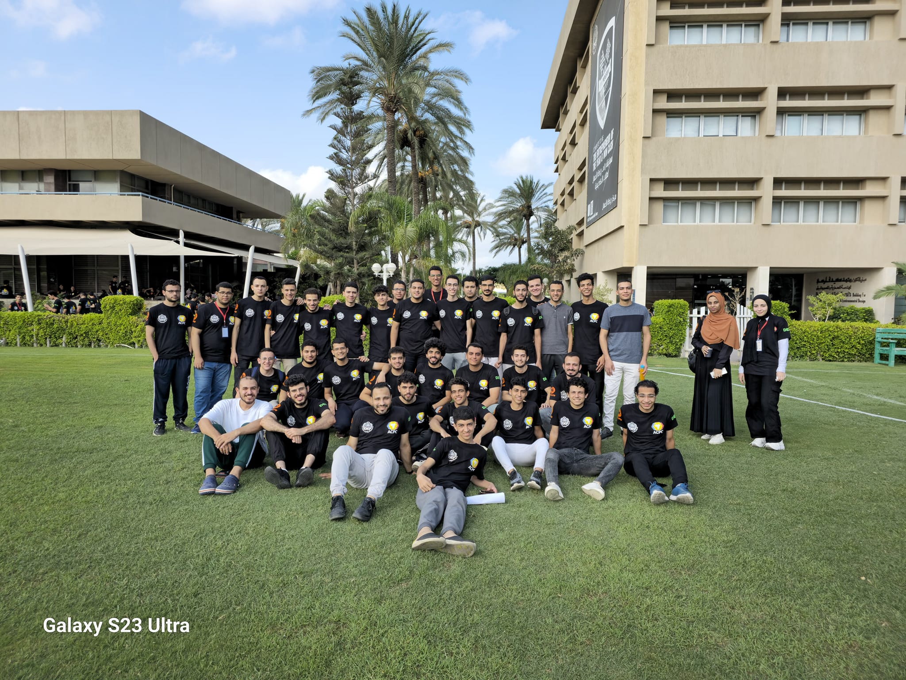
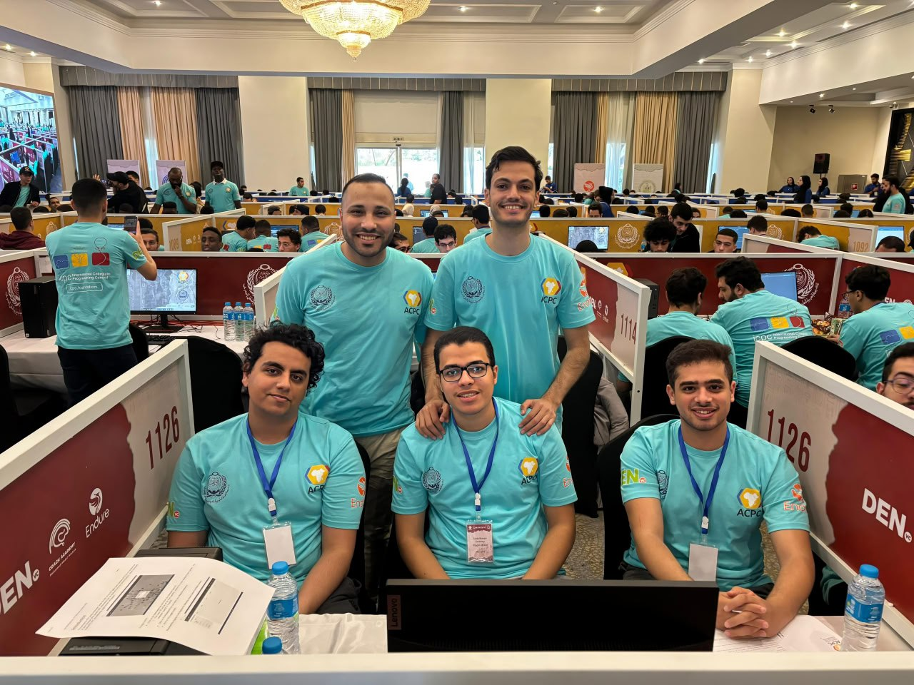
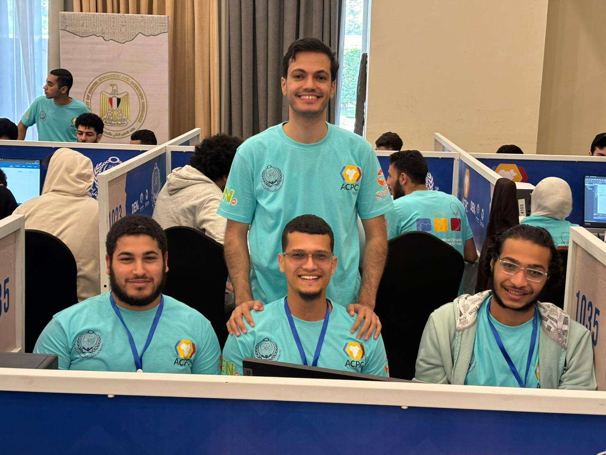

## 🏆 2024 Regional Participation

We proudly participated in **ECPC 2024** with **13 teams** representing Menofia University.

  

## 🏅 ACPC 2024 – Luxor

We also took part in **ACPC 2024**, held in **Luxor**, with **three qualified teams**:

- **Triple Threat**  
- **Strong Connected Menofia**
- **Not Clean Code**

  

### 📸 Team Highlights

  

    
  

  

    
  

