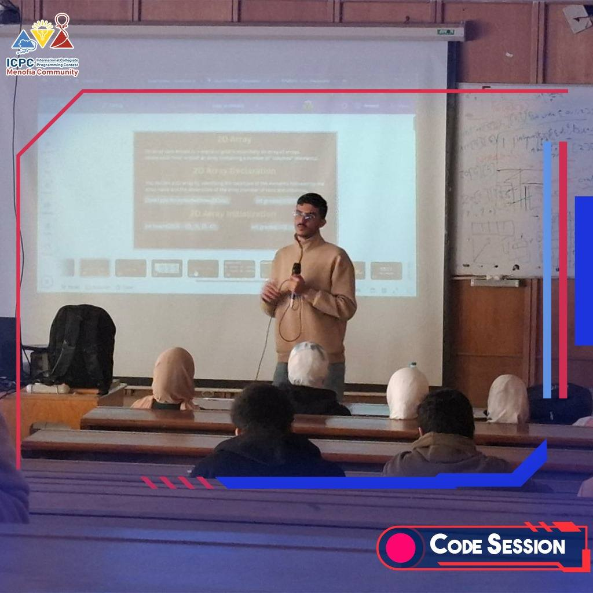

# 2025 Mid-Year Onsite Sessions

We organized a set of **mid-year onsite sessions** to help students at different skill levels improve their programming abilities:

- **Newcomers:** Introduction to competitive programming and basic problem-solving techniques.  
- **Level 1:** Introduction to STL (Standard Template Library) and how to use it in solving problems.  
- **Level 2:** Introduction to Dynamic Programming with real problem examples.

## 📸 Session Image Gallery

  

    
  

  

    
  

  

    
  

  

    
  

  

    
  

  

    
  

